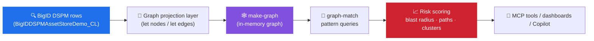
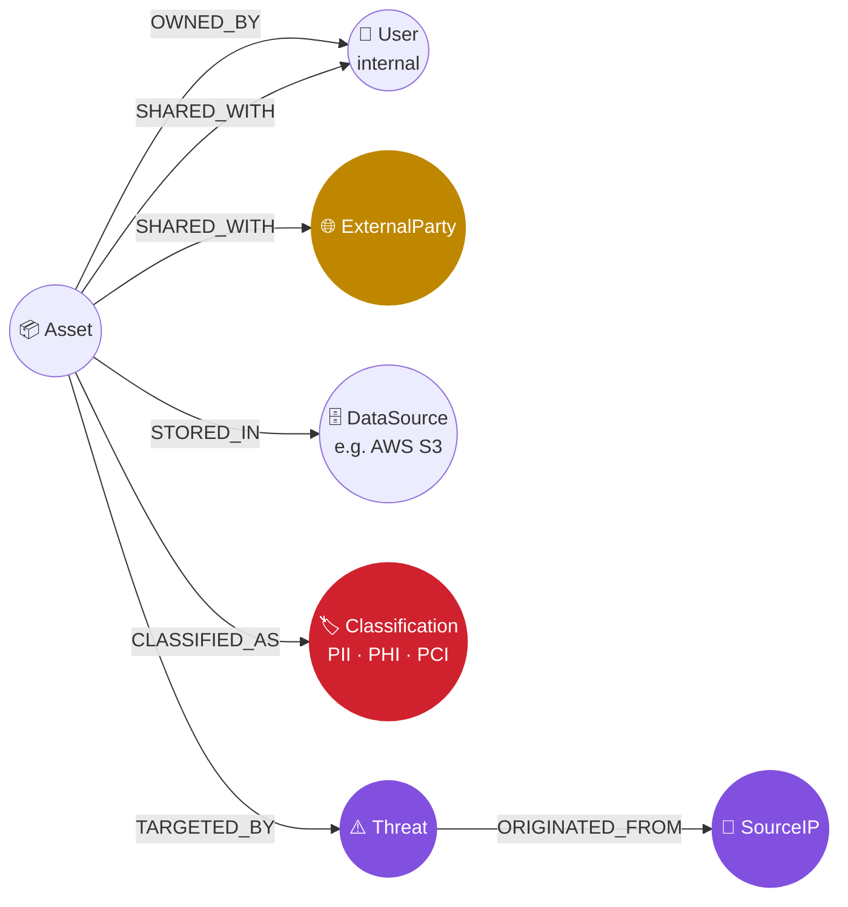
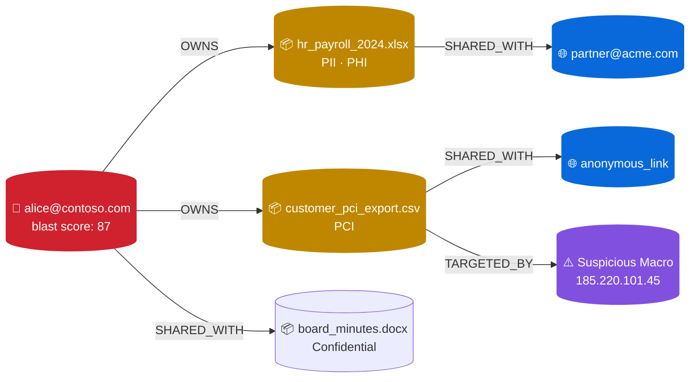
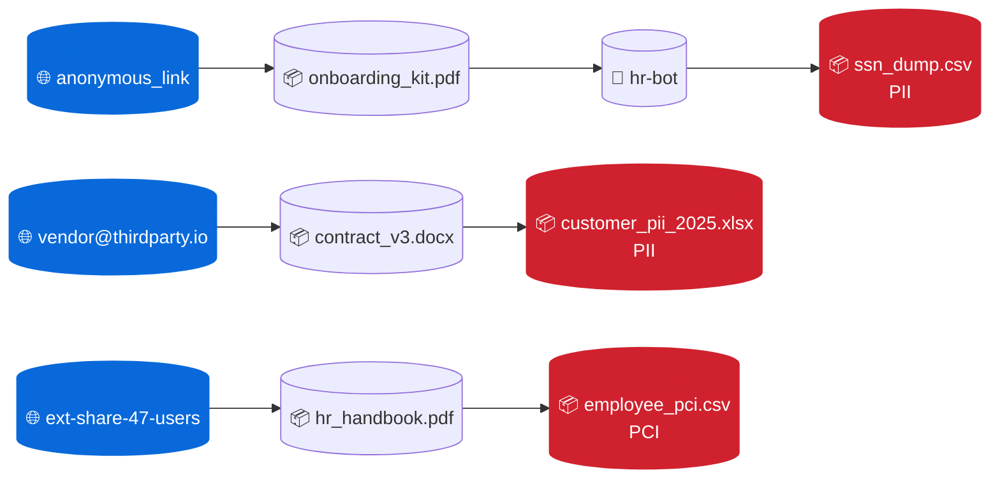

# BigID × Sentinel Graph — Sensitive Data Blast Radius

> **Bonus / ideation repo.** Companion to [`bigid-sentinel-mcp-demo`](https://github.com/MitchellGulledge3/bigid-sentinel-mcp-demo). Where the MCP repo turns BigID telemetry into **flat KQL questions**, this repo turns the same data into a **security graph** and uses **KQL graph operators** (`make-graph`, `graph-match`) to answer questions you literally cannot ask in flat KQL.

The pitch in one line: **BigID tells you where the sensitive data lives. Sentinel Graph tells you the blast radius if any one node moves the wrong way.**

---

## Why a graph at all?

Flat KQL answers *what*. Graph KQL answers *what is reachable from what*.

| Flat-KQL question (already in `bigid-sentinel-mcp-demo`) | Graph question (this repo) |
| --- | --- |
| "How many sensitive assets are externally shared?" | "Which **external user** is one share-hop away from the most PII?" |
| "Which assets are orphaned?" | "Which **clusters of orphaned assets** all share the same access path?" |
| "Show me threat hits on regulated data." | "Trace every **path** from a Tor exit IP through threats to PCI assets, ≤ 3 hops." |
| "Where are DLP gaps?" | "Find **rings of unprotected sensitive assets** that share an owner and a data source." |
| "Show external exposure." | "Which **departments** are 2 hops away from publicly-shared PHI?" |

Same BigID data. New shape. New questions. Same `BigIDDSPMAssetStoreDemo_CL` table from the sister repo — no new ingestion needed.

---

## Demo in VS Code (90 seconds, with rendered graphs)

This is the fastest way to show it live in front of someone — pure VS Code, rendered graph visualizations, no browser flipping.

### One-time setup

```bash
git clone https://github.com/MitchellGulledge3/bigid-sentinel-graph-demo.git
cd bigid-sentinel-graph-demo
code .
az login   # use a user that has Log Analytics Reader on the workspace
```

When VS Code opens the folder, install the **recommended extensions** when prompted:
- [`bierner.markdown-mermaid`](https://marketplace.visualstudio.com/items?itemName=bierner.markdown-mermaid) — renders Mermaid in Markdown preview
- [`ms-toolsai.jupyter`](https://marketplace.visualstudio.com/items?itemName=ms-toolsai.jupyter) — opens & runs the `.ipynb` notebooks

### Option A — Jupyter notebooks (recommended for the call) 📓

The `notebooks/` folder contains 5 pre-executed Jupyter notebooks. **They already have rendered graph images baked in.** Just open one — you'll see the visualization instantly without running anything.

| Notebook | Renders |
| --- | --- |
| [`notebooks/01-blast-radius.ipynb`](notebooks/01-blast-radius.ipynb) | Identity → reachable sensitive assets |
| [`notebooks/02-external-exposure.ipynb`](notebooks/02-external-exposure.ipynb) | External party → PII/PHI/PCI assets |
| [`notebooks/03-orphan-clusters.ipynb`](notebooks/03-orphan-clusters.ipynb) | Data source ← orphaned sensitive assets |
| [`notebooks/04-threat-movement.ipynb`](notebooks/04-threat-movement.ipynb) | Malicious IP → threat → regulated assets |
| [`notebooks/05-cross-source-leakage.ipynb`](notebooks/05-cross-source-leakage.ipynb) | Owner → classification → 10 data sources |

To re-run live in the call:
```bash
python3 -m venv .venv && source .venv/bin/activate
pip install jupyter ipykernel matplotlib networkx pandas
```
Then in VS Code, open a notebook → click **Run All**. Each notebook re-runs the live KQL against your workspace and re-renders the NetworkX graph.

### Option B — Mermaid via `demo.py` ⚡

Faster cycle, no Jupyter needed:

```bash
python3 demo.py 1     # writes output/01-…md with a Mermaid graph
python3 demo.py all   # all five
```

Open the file in `output/` and press **`⇧⌘V`** (Mac) / **`Ctrl+Shift+V`** (Win/Linux) — the Mermaid diagram renders in VS Code's preview pane.

### Talk track (90 seconds)

| Step | Say | Show |
| :-: | --- | --- |
| 1 | "Same BigID data — projected as a graph." | `docs/graph-model.md` preview |
| 2 | "Compromise this user → here's the blast radius." | open `notebooks/01-blast-radius.ipynb` |
| 3 | "External auditor — one hop from PHI/HIPAA." | open `notebooks/02-external-exposure.ipynb` |
| 4 | "Tor exit IP already touching trade secrets." | open `notebooks/04-threat-movement.ipynb` |
| 5 | "Each of these is one `Save as tool` away from being agent-callable." | link to [`bigid-sentinel-mcp-demo-ui`](https://github.com/MitchellGulledge3/bigid-sentinel-mcp-demo-ui) |

### If you want a different workspace

```bash
export BIGID_GRAPH_WORKSPACE_ID=<your-workspace-guid>
python3 demo.py 1
```

---

## Architecture at a glance



---

## The graph model

Each row in `BigIDDSPMAssetStoreDemo_CL` is unfolded into multiple **nodes** and **edges**. Nothing new gets ingested — the graph is derived at query time.



Full mapping (which BigID columns become which nodes / edges) is in [`docs/graph-model.md`](docs/graph-model.md).

---

## The 5 graph queries

Each query lives as its own `.kql` file in [`graph-queries/`](graph-queries/) and can be pasted straight into Microsoft Defender XDR Advanced Hunting (or saved as a Sentinel custom MCP tool the same way the sister repo does it).

| # | File | Question it answers |
| - | --- | --- |
| 1 | [`01-sensitive-data-blast-radius.kql`](graph-queries/01-sensitive-data-blast-radius.kql) | "If user X is compromised, how many sensitive assets are reachable in ≤ 2 hops, and what's the worst-case classification?" |
| 2 | [`02-external-exposure-paths.kql`](graph-queries/02-external-exposure-paths.kql) | "Show every path from an **external party** to a **PII / PHI / PCI** asset." |
| 3 | [`03-orphan-cluster-detection.kql`](graph-queries/03-orphan-cluster-detection.kql) | "Find clusters of **orphaned** sensitive assets that share an access path — these are the silent risk piles." |
| 4 | [`04-threat-lateral-movement.kql`](graph-queries/04-threat-lateral-movement.kql) | "Trace every path from a malicious source IP through threats and onto regulated assets, ≤ 3 hops." |
| 5 | [`05-cross-source-leakage.kql`](graph-queries/05-cross-source-leakage.kql) | "Which sensitive classifications appear in 3+ data sources via the same owner? (data sprawl)" |

---

## Example: blast radius result, visualized

A trimmed, real-shape result of [query 1](graph-queries/01-sensitive-data-blast-radius.kql) might look like this:



Reading it: compromise alice → 3 sensitive assets reachable, 1 already targeted by malware from a Tor exit, 1 already on an anonymous link. **That is the blast radius story** — and it falls out of one `graph-match` pattern.

---

## Example: external-exposure paths, visualized

[Query 2](graph-queries/02-external-exposure-paths.kql) finds shortest paths from any external identity into regulated data:



Three independent 2-hop exposure paths, surfaced from one query.

---

## Why this matters for the BigID conversation

1. **BigID owns the data classification truth.** Sentinel Graph turns that truth into reachability.
2. **Combined story = differentiator.** Other DSPMs stop at "this asset is sensitive." BigID + Sentinel Graph = "and here are the 14 humans + 2 IPs + 3 data sources currently within 2 hops of it."
3. **It's all KQL.** No new SDK, no new ingestion, no new product. Same workspace, same MCP plumbing, same `Save as tool` flow.
4. **Composes with MCP.** Each `.kql` here can be saved as a custom MCP tool exactly like the [`bigid-sentinel-mcp-demo`](https://github.com/MitchellGulledge3/bigid-sentinel-mcp-demo) tools — graph reasoning becomes an agent capability.

---

## File map

| Path | Purpose |
| --- | --- |
| `README.md` | This file |
| `docs/graph-model.md` | Node/edge schema and how it maps from BigID columns |
| `docs/use-cases.md` | Talk track for each of the 5 queries (audience, story, why graph) |
| `graph-queries/01-sensitive-data-blast-radius.kql` | Blast-radius scoring per identity |
| `graph-queries/02-external-exposure-paths.kql` | Shortest exposure paths from external parties |
| `graph-queries/03-orphan-cluster-detection.kql` | Find clusters of orphaned sensitive assets |
| `graph-queries/04-threat-lateral-movement.kql` | Threat IP → regulated asset paths |
| `graph-queries/05-cross-source-leakage.kql` | Same-classification sprawl across data sources |

---

## Prerequisites

- A Microsoft Sentinel workspace with the `BigIDDSPMAssetStoreDemo_CL` table populated.
  - Easiest path: run [`bigid-sentinel-mcp-demo`](https://github.com/MitchellGulledge3/bigid-sentinel-mcp-demo)'s LogSeeder first (500 rows in ~3 minutes).
- Access to **Microsoft Defender XDR Advanced Hunting** or any KQL surface that targets the workspace.

That's it. Open a `.kql` file, paste, run.

---

## Further reading

- [KQL graph operators — `make-graph`, `graph-match`](https://learn.microsoft.com/azure/data-explorer/kusto/query/graph-operators)
- [Microsoft Sentinel — custom MCP tools (preview)](https://learn.microsoft.com/azure/sentinel/datalake/sentinel-mcp-create-custom-tool)
- Sister repos:
  - [`bigid-sentinel-mcp-demo`](https://github.com/MitchellGulledge3/bigid-sentinel-mcp-demo) (API publish)
  - [`bigid-sentinel-mcp-demo-ui`](https://github.com/MitchellGulledge3/bigid-sentinel-mcp-demo-ui) (Defender portal publish)
